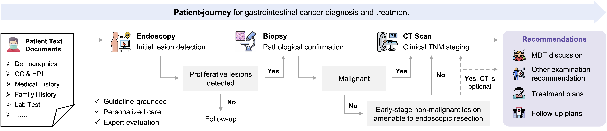

 

<h1 style="text-align: center;">GI-Navigator: an Agentic System throughout Patient-journey of Gastrointestinal Cancer</h1>

GI-Navigator is a LLM-driven and guildline-grounded agentic system for personalized management of gastrointestinal cancer, including procedures like multi-modal diagnosis, adaptive examination pathway planning, treatment decision-making.

GI-Navigator comprise a LLM-powered scheduler agent, three specialized visual agents for different imaging modalities, a RAG tool for clinical guideline invocation.

Key features of GI-Navigator:
- Adaptive examination pathway planning.
- Multi-modal integration.
- Report generation for endoscopic video, pathogical WSI, and volumetric CT-CAP.
- Guildine-grounded and personalized decision-making and recommendation.
- MDT discussion.
- Chat-based intervention of decision-making.
- Easy to extend to additional imaging modalitis (e.g., EUS, PET-CT) and tools.

## News

- [2026/03] GI-Navigator is Released. The examples, data and codes are under preparation. Stay tuned!